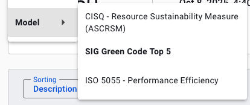

# Green Code

Green Code is a beta feature focused on the code's **sustainability** and **resource efficiency**. This may be available for your system. It depends on which capabilities have been activated specifically for your system or portfolio.

## Navigating the Green Code Overview
The Green Code overview page shows a star rating, a summary of findings, their change, age and estimated severity. 


The different elements in this page are:
* *Findings* shows a count of *the current number of findings*. Below it is the number of changes, based on the source code comparison period. This range be changed in the top right as usual. The note *"Also showing ... resolved findings and ... informational findings"* means that on top of this number, more findings are shown below. This is relevant for estimating activity surrounding these findings, such as fixing Green Code findings or marking them as *false positive*. 
* *Activity* shows a breakdown of this number. A mouseover on the *Activity* bar chart will show the following:


* The *Findings Age* tile gives an indication how long findings are known. 

* The *Severity* tile summarizes a breakdown of findings according to CWE severity ratings. A mouseover on the bar chart will show the exact number of findings. A mouseover on the severity bar chart shows the number of findings with that severity category. 

## Different statuses of green code findings

These are the different statutes of findings. The status *"Fixed"* will be applied automatically if a finding is resolved. See [Security Findings FAQ: Fixed issues are auto-detected](faq-security.md#how-does-the-automatic-detection-of-fixed-findings-work). The other statuses can be set. They are similar to those used for [system maintainability refactoring candidates](system-maintainability.md#refactoring-candidates). 
* *"Raw"* means "not yet verified" where *"Refined"* ones mark that a finding has been confirmed manually. Inversely, a finding can be set as *"False positive"*. 
* *"Will fix"* signals the intention to fix it, while *"Risk Accepted"* does not.

## Different possible groupings of green code findings
Different views can be selected in the top left menu. 



In the Grouping menu under *"Finding"*, the following types of grouping can be set:
* *"Activity"* groups according to *"New"*, *"Recurring"* or *"Resolved"*.
* *"Origin"* refers to the originating tool of the finding.
* *"Severity"* orders on level of severity (based on CVSS).
* *"Status"* lists the statuses as [mentioned above](#different-statuses-of-green-code-findings).
* *"Type"* shows a specific list of vulnerabilities. This is especially useful for technical analysis, since sometimes, a whole category/type of findings may be set to *"False positive"* (also, see [below in the prioritizing section](#a-general-typical-strategy-for-processing-security-findings)). 
* *"Weakness"* orders on type of weakness (based on [MITRE's *CWE* database](https://cwe.mitre.org/)). Weaknesses are defined somewhat higher level than *"Type"*. 

In *"Location"*, either *"Component"* or *"File"* grouping can be chosen. The Component group follows the maintainability grouping in components. Findings may fall outside of that grouping because of exclusions. Then they will show under the *"Other"* component. Examples might be binaries or package manager configuration files, which would be excluded for maintainability analysis and therefore not fall into a component for the purpose of maintainability calculations. 

Under *"Model"*, different Models can be used to map findings on. We have three options available: the SIG Green Code Top 5, further explained [below](#different-types-of-sig-green-code-top-5-findings), CISQ - Resrouce Sustainability Measure (ASCRSM), and ISO 5055 - Performance Efficiency, looking specifically at performance findings. 

### A note on seeing the same file/finding multiple times
* **A specific finding** is counted once, but it may be visible in multiple views. This could be because e.g. there is certain overlap in classification of the model that you have chosen as a view. 
* **A specific line** may be counted multiple times if it refers to multiple *CWEs*: a count is applied for each possible green code finding. See also [Security FAQ elaboration on multiple views of the same finding](faq-security.md#why-does-the-finding-list-count-certain-findings-twice) (in the Security finding documentation).

## Different types of SIG Green Code Top 5 findings
The SIG Green Code Top 5 model has the following categories:

### 1. Inefficient Resource Usage
Findings about machine resources being wasted in some way. Examples include unnecessary caching in Docker images, which increase the size of the image, and incorrect use of threads, which cause unnecessary computation.

### 2. Inefficient Computation
Various computational and algorithmic inefficiencies that can decrease performance, and thus unnecessarily increase energy usage. Examples include using outdated, inefficient data structures that can be easily replaced by their modern counterpart. 

### 3. Expensive Operations in Loops
A specific type of inefficient computation. Findings in this category are about unnecessary extra time complexity in loops. Take the following Java example:

```java
// Process tasks in order until no more "urgent" tasks are left.
while (tasks.contains("urgent")) {
  String current = tasks.removeFirst(); 
  processTask(current);
}
```

Because `List.contains()` in Java is an O(n) operation - the whole list needs to be checked linearly - this for loop's total time complexity becomes O(n^2).

Loops like this can be made more efficient by, for example, using a `HashSet` instead of a `List`, if possible. `HashSet.contains()` is an O(1) operation.

Fixing these findings has more impact if the list is larger.

### 4. Inefficient Data Query
Findings in this category are about anti-patterns found in data queries, like SQL. 

### 5. Error Handling
Findings about error handling. For example, not closing threads properly after an error is thrown, or not handling errors early enough, leading to unnecessary resource usage.

## Security and Open Source Health findings in Green Code
Some Green Code findings are security or open source vulnerabilities that are also relevant for the sustainability of the software. Attackers may be able to use vulnerabilities to cause unnecessary usage, for example when attempting a denial of service attack. Furthermore, non-malicious actors may accidentally cause less severe versions of the vulnerability, also causing unnecessary computations. 

## Linking to Code Explorer
On the top right you can show the code in the *"Code Explorer"*, which will show you the code's context and related findings. See also [Code Explorer](system-code-explorer.md). 


## SIG may offer consultancy services to help you with green software
Depending on your agreement with SIG, green software consultancy may be available. Or this can be offered as a separate consultancy effort.

