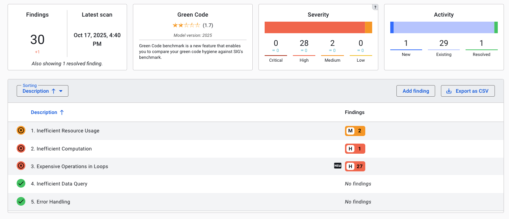

# Green Code

Green Code is a beta feature focused on the code's sustainability and resource efficiency. This may be available for your system. It depends on which capabilities have been activated specifically for your system or portfolio.

## Navigating the Green Code Overview
The Green Code overview page shows a star rating, a summary of findings, their change, age and estimated severity. 


The different elements in this page are:
* *Findings* shows a count of *the current number of findings*. Below it is the number of changes, based on the source code comparison period. This range be changed in the top right as usual. The note *"Also showing ... resolved findings and ... informational findings"* means that on top of this number, more findings are shown below. This is relevant for estimating activity surrounding these findings, such as fixing Green Code findings or marking them as *false positive*. 
* *Activity* shows a breakdown of this number. A mouseover on the *Activity* barchart will show the following:


* The *Findings Age* tile gives an indication how long findings are known. 

* The *Severity* tile summarizes a breakdown of findings according to CWE severity ratings. A mouseover on the barchart will show the exact number of findings. A mouseover on the severity barchart shows the number of findings with that severity category. 

## Different statuses of green code findings

These are the different statutes of findings. The status *"Fixed"* will be applied automatically if a finding is resolved. See [Security Findings FAQ: Fixed issues are auto-detected](faq-security.md#how-does-the-automatic-detection-of-fixed-findings-work). The other statuses can be set. They are similar to those used for [system maintainability refactoring candidates](system-maintainability.md#refactoring-candidates). 
* *"Raw"* means "not yet verified" where *"Refined"* ones mark that a finding has been confirmed manually. Inversely, a finding can be set as *"False positive"*. 
* *"Will fix"* signals the intention to fix it, while *"Risk Accepted"* does not.

## Different possible groupings of green code findings
@@TODO

## Different types of SIG Green Code Top 5 findings
@@TODO

### 1. Inefficient Resource Usage
Resources on the machine being wasted in some way. For example: when using `pip` to install a Python library in a Dockerfile, this library is cached by default. This unnecesarily increases the size of the Docker image. Another example is the use of `ThreadLocal` variables in Java. These should be correctly cleaned up. 

### 2. Inefficient Computation
@@TODO

### 3. Expensive Operations in Loops
A specific type of inefficient computation. Findings in this category are about unnecesary extra time complexity in loops. Take the following Java example:

```java
// Process tasks in order until no more "urgent" tasks are left.
while (tasks.contains("urgent")) {
  String current = tasks.removeFirst(); 
  processTask(current);
}
```

Because `List.contains()` in Java is an O(n) operation -- the whole list needs to be checked linearly -- this for loop's total time complexity becomes O(n^2).

Loops like this can be made more efficient by, for example, using a `HashSet` instead of a `List`, if possible. `HashSet.contains()` is an O(1) operation.

If the size of the list is small, fixing these findings may not have a significant impact.

### 4. Inefficient Data Query
@@TODO

### 5. Error Handling
@@TODO

## Open Source Health findings in Green Code
@@TODO


## Linking to Code Explorer
On the top right you can show the code in the *"Code Explorer"*, which will show you the code's context and related findings. See also [Code Explorer](system-code-explorer.md). 


## SIG may offer consultancy services to help you with green code
Depending on your agreement with SIG, green code consultancy may be available. Or this can be offered as a separate consultancy effort.

